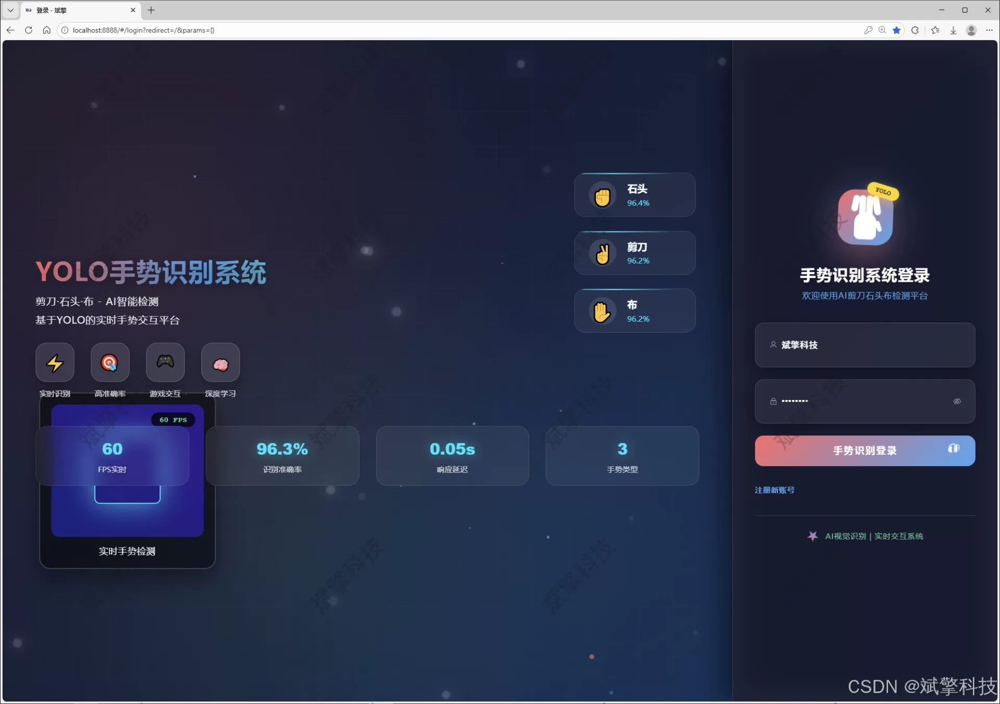
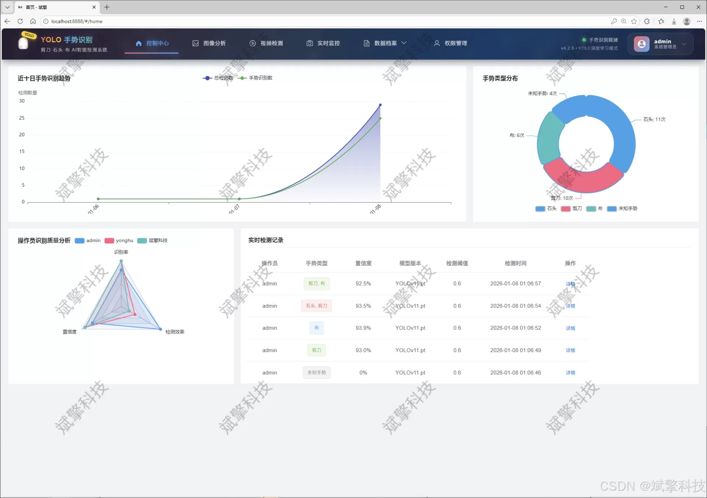
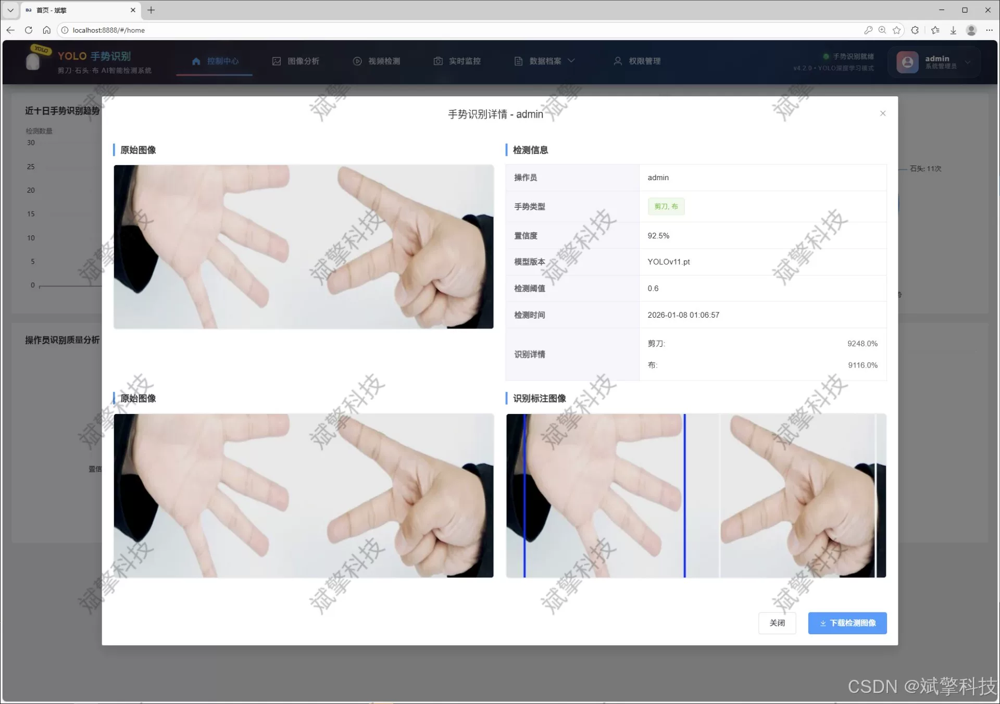
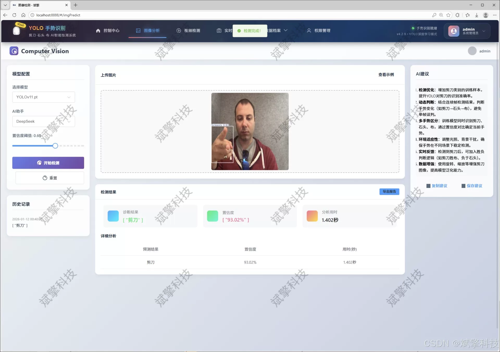
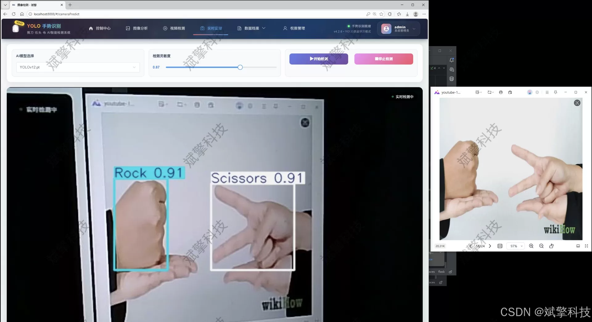
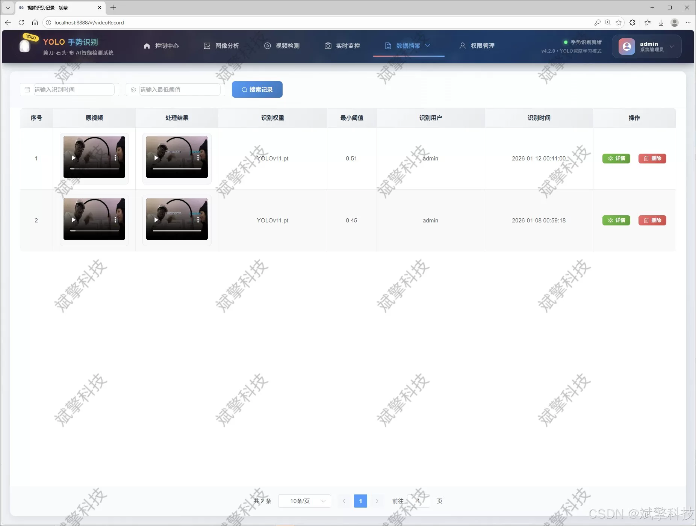
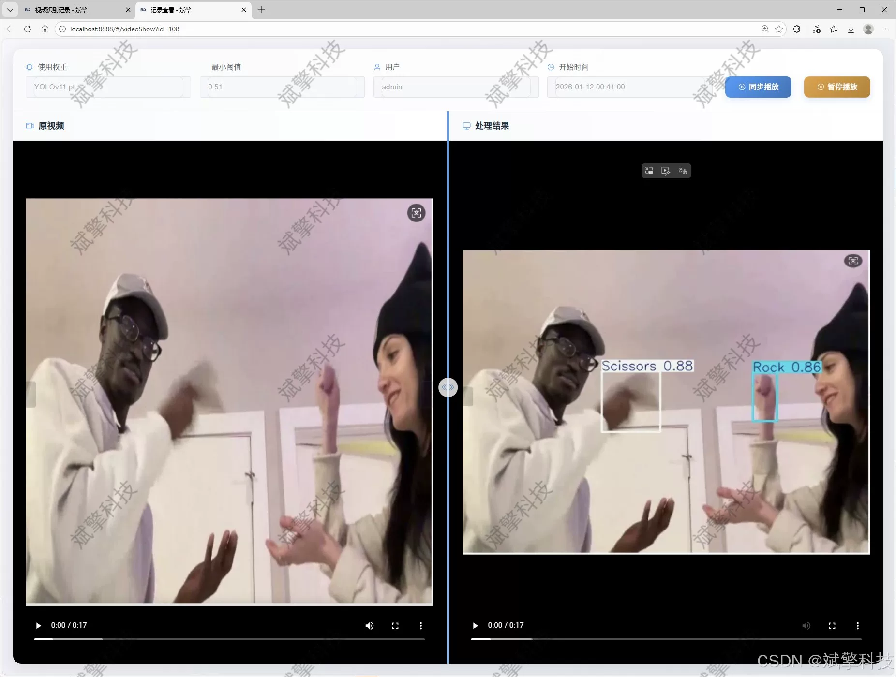
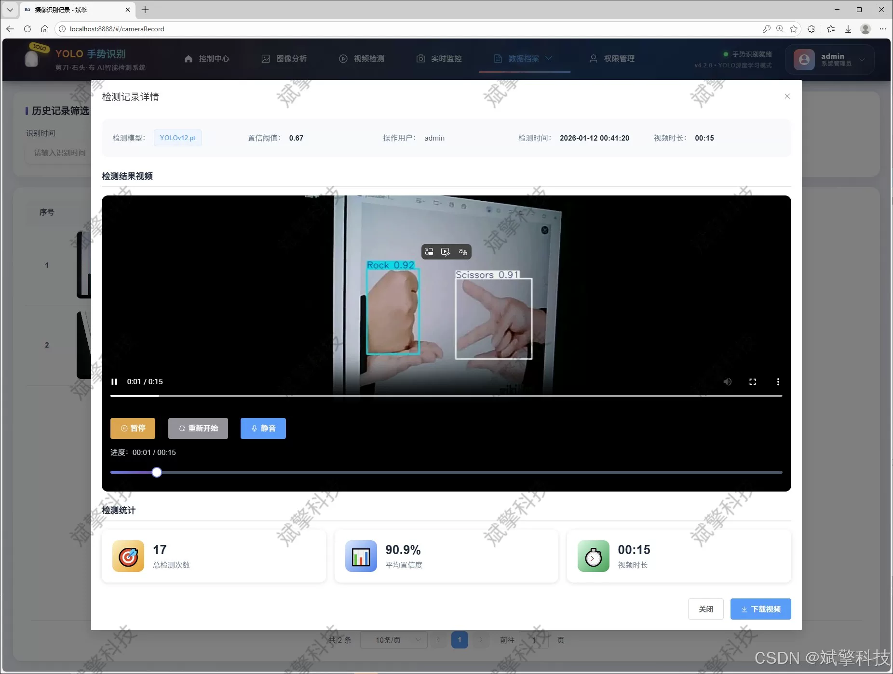

# YOLO for Rock-Paper-Scissors Detection

## Body

YOLO (You Only Look Once) is a deep learning model that is used for object detection. It is a single-stage detector that can detect objects in real-time. The YOLO model is trained on a large dataset of images, and it can detect objects in the image even if they are not labeled.

The YOLO model uses a neural network to classify the objects in the image. The neural network takes as input the features of the image, such as the color and shape of the objects, and outputs a probability distribution over the classes of the objects. The model then selects the class with the highest probability as the predicted class.

In the context of stone-paper-scissors game detection, the YOLO model could be used to identify whether an object in an image is a stone, paper, or scissors. The model would need to be trained specifically on images of the game, and it would need to be evaluated on how well it can distinguish between different types of objects in the game.

(Full product description was not available from the source page.)

## Images

## Payment

Here is a pay link on Stripe ( https://buy.stripe.com/3cs8yP7sY87d0vu9AB ). Please contact me lonlonago@foxmail.com after funding $89, and I will send you a complete data files , thank you!

